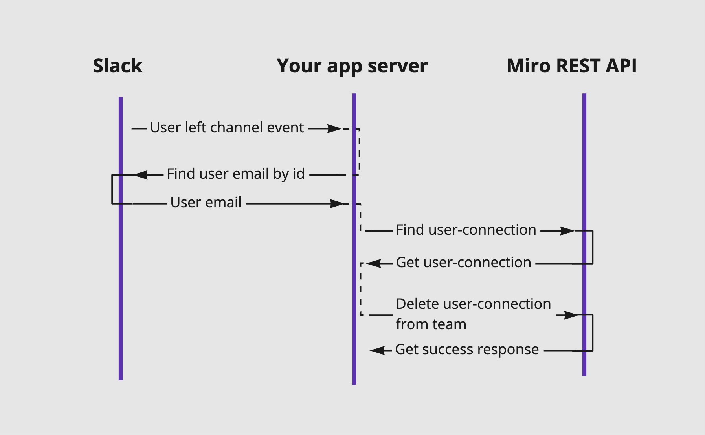

## Intro
This example explains how to add and remove members from your team, based on data from an external source. 

For example, add new Miro user to a team when new mew user joins a specific slack channel, and remove a user from Miro team when a user leaves Slack channel.

### Use case data flow

Case 1: Invite new slack users to Miro team


 
Case 2: Remove from Miro team that left Slack channel


 
## Preparation

###### Step 1. Clone the repo and install the dependencies
```bash 
git clone https://github.com/miroapp/app-examples.git
cd app-examples/automate-user-management
npm install
``` 

###### Step 2. Start Node server locally 

```bash
npm run start
```

###### Step 3. Expose a local web server to the internet

```bash
ngrok http 8000
```

###### Step 4. Create App in Slack

- This [guide](https://api.slack.com/start/overview#creating) shows you how to create app.

- Select scopes: `channels:read`, `groups:read`, `users:read`, `users:read.email`

- Verify Request URL

- Enable Events: `member_joined_channel`, `member_left_channel`

- Install the application and replace the received Sack OAuth token in the `index.js` file

###### Step 5. Create App in Miro
- This [guide](https://developers.miro.com/docs/getting-started) shows you how to do it.

- [Scopes](https://developers.miro.com/reference#scopes) used in this example: `team:read`, `team:write`

- Install the application and replace the received Miro OAuth token in the `index.js` file


###### Step 6. Restart Node server