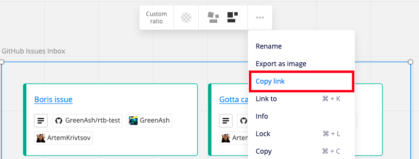

## GitHub issues importer app

This example shows how to import issues from GitHub to a board with custom fields using Miro API

## Common setup

Clone the repo and install the dependencies

```bash
git clone https://github.com/miroapp/app-examples.git
cd app-examples/github-issues-importer
```

```bash
npm install
```

## Configuration

All configuration properties are stored within `config.js`:
```javascript
{
    github: {
        token: 'github-token',
    },
    miro: {
        token: 'miro-token',
        boardId: 'board-id',
        inboxFrameId: 'frame-id'
    }
}
```

Properties which should be configured:
- `github-token` - GitHub token with reading issues permissions, e.g. with `repo` scope;
- `miro-token` - miro token with `boards:write` scope;
- `board-id` - board id for which `miro-token` user has access to;
- `frame-id` - frame id which will hold the created widgets

> **How to get frame id?**
> 
> Click on "Copy link" as shown on the screenshot below:
>
> 
>
> Copied link would have frame id within moveToWidget query param, 
> e.g. https://miro.com/app/board/<board-id>/?moveToWidget=**3074457346806294028**

## Run

To import data onto the board, run the following

```bash
npm start
```


