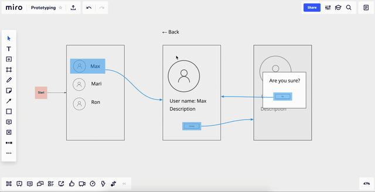

# Prototyping plugin

With this plugin users can build interactive prototypes like in InVision or Overflow. Very comprehensive example for a
lot of SDK capabilities, including experimental features.

_This plugin was created for demo purpose, it does not ready for production usage._

# How feature works

# How to build

- Run `npm install`
- Replace `CLIENT_ID` in [`src/config.ts`](src/config.ts) file You can get _CLIENT_ID_ in app settings.
- Run `npm run build` or `npm run watch` to compile app
- Run serve the app `npx serve -p 8081`
- Run `ngrok` using `npx ngrok http 8081`
- Get https url from _ngrok_ and paste it in `iframe url` in your app settings.
