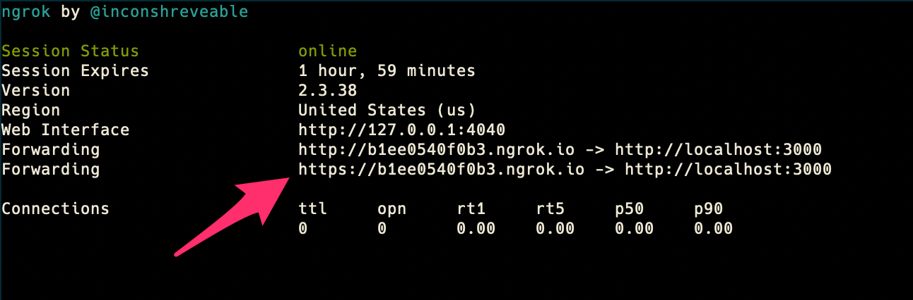

# Sample Miro app

Handy playground for playing with Miro Board API and Web-plugins.

### How to use

1. Run `npm install`
2. Run `cp .env.example .env`
3. Run `npm run ngrok` in another terminal
4. Copy the `https` url:
   
5. Edit `.env` file:
   - Set BASE_URL from ngrok `https://XXXXXXXXXXXX.ngrok.io`
   - Set CLIENT_ID from the [App settings](https://miro.com/app/settings/user-profile/apps)
   - Set CLIENT_SECRET from the [App settings](https://miro.com/app/settings/user-profile/apps)
6. Run `npm run start`
7. Open app landing (url from ngrok, like `https://XXXXXXXXXXXX.ngrok.io`)
8. Configure app (you can copy/paste from the Welcome page):
   1. Web-plugin: save `https://XXXXXXXXXXXX.ngrok.io/static/web-plugin/`
   2. Redirect URLs: add `https://XXXXXXXXXX.ngrok.io/oauth`
9. Explore & have fun!

### How it works

`app.js` is the entry point

`api.js` contains methods for work with API

`db.js` is simple DataBase which works with file database.txt
