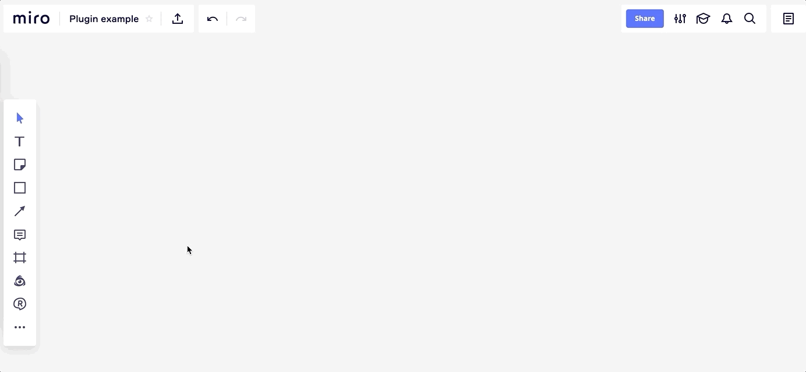

## Intro

This is a sample roadmap template builder you can build on Miro web SDK. It shows how to create and position on the
board multiple widgets of different types and render create custom interfaces in the library.



## Preparation

###### Step 1. Clone the repo and install the dependencies

```bash
git clone https://github.com/miroapp/app-examples.git
cd app-examples/template-builder
```

###### Step 2. Start a server locally using `serve`

```bash
npx serve -p 8080
```

###### Step 3. Expose a local web server to the internet

```bash
npx ngrok http 8080
```

###### Step 4. Create App in Miro

- This [guide](https://developers.miro.com/docs/getting-started) shows you how to do it.

- Install the application
