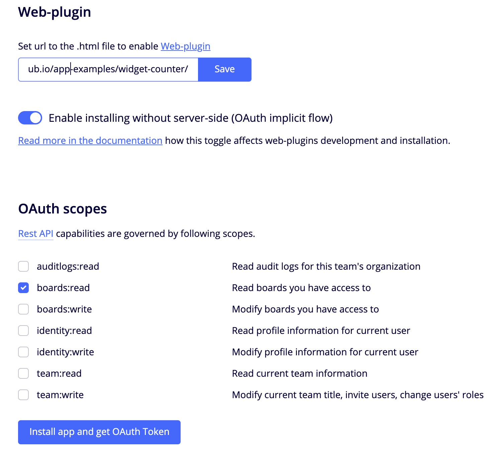

## Widgets counter app app

This example shows how to count widgets on the board using Client SDK

## Configuration

You need to serve `widget-counter` folder on the server through https, one of the easiest ways to do it is to fork this
repo and use [GitHub Pages](https://pages.github.com/) to serve it.

Next step is to create an application in miro, you can use this [guid](https://developers.miro.com/docs/getting-started)
it will help you.

Configure the application as follows:

- enter uri for the `widget-counter` resource in `Web-plugin` section, e.g. if you use GitHub Pages uri will be as
  follow: `https://<nickname>.github.io/app-examples/widget-counter/`;
- choose `boards:read` scope.

## Run

Install the application using `Install app and get OAuth Token` and then open or create board within the team on which
you install the app: you will see a new icon
 at the bottom bar, as
shown on gif image at the top of this `readme`.
